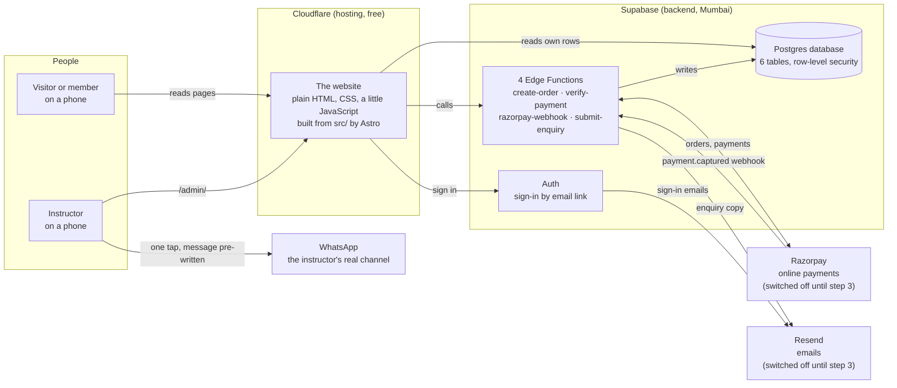
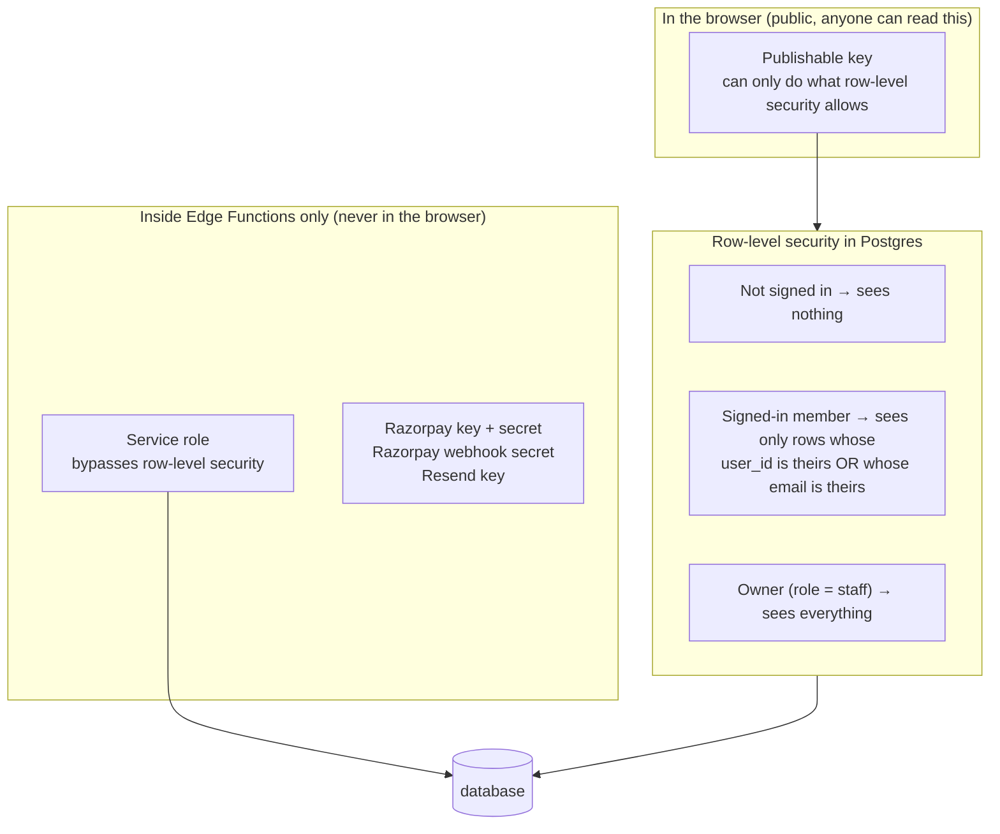
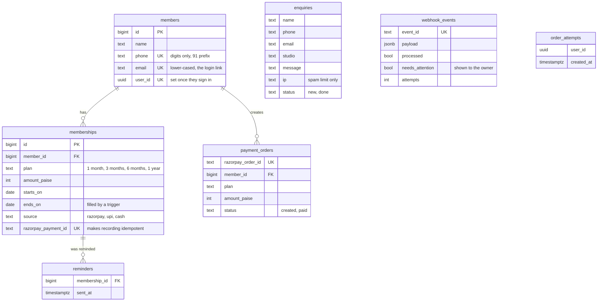
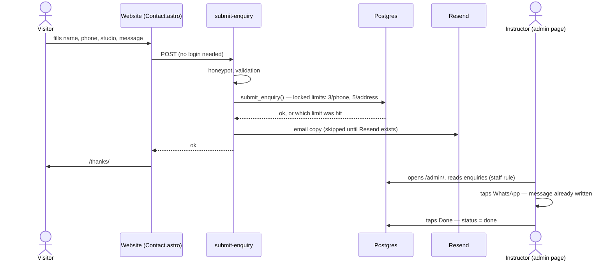
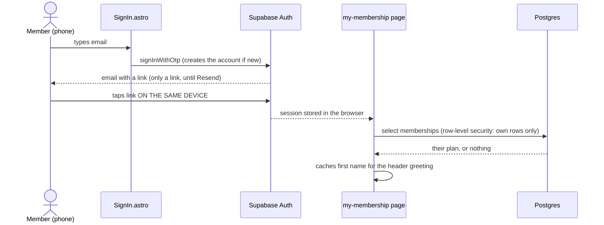
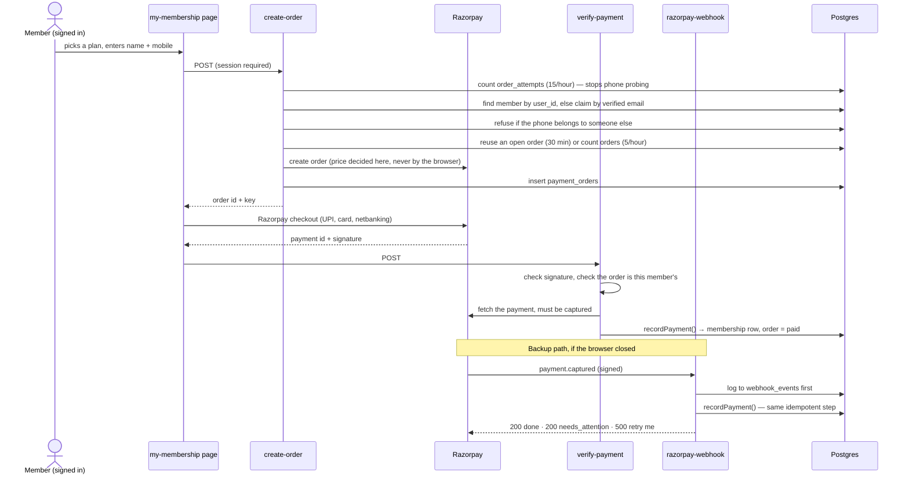

# How the Viral Yoga & Nature Cure website fits together

Last updated: 9 September 2026. Every name in this document is a real file, table or service in this repository. If something here disagrees with the code, the code is right and this page needs fixing.

The diagrams render on GitHub. Read this page at https://github.com/datewithcode/viral-yoga-website/blob/main/docs/ARCHITECTURE.md.

## 1. The whole system on one page

There are four moving parts and three outside companies. Nothing else.

**The key idea:** the website is a folder of finished files. It has no server of its own. Everything that needs a server, a database or a secret runs inside Supabase. That is why hosting is free and why the public pages keep working even if Supabase is asleep.

## 2. Where everything lives

| Piece | Where | What it is |
|---|---|---|
| All content | `src/data/site.ts` | Every name, number, address, price, sentence, plan, question, and the on/off switches |
| Public pages | `src/pages/*.astro` | `index` (home), `my-membership`, `admin`, `privacy`, `terms`, `refunds`, `thanks`, `404` |
| Sections of the home page | `src/components/*.astro` | One file per section, in the order they appear on the page |
| Sign-in form | `src/components/SignIn.astro` | Self-contained. Used by the membership page |
| Browser helper | `src/lib/supabase.ts` | Creates the Supabase client and the one shared `projectRef` |
| Styling | `src/styles/global.css` | Colours and fonts as Tailwind tokens, plus the shared button and field classes |
| Database | `supabase/migrations/*.sql` | The tables, their rules, and every change in order |
| Server code | `supabase/functions/*/index.ts` | The four functions, plus `_shared/payments.ts` they all use |
| Hosting config | `wrangler.toml`, `public/_headers`, `.node-version` | Cloudflare reads these. `netlify.toml` is left over and unused |
| Tests | `tests/` | 96 backend cases, 9 build checks (incl. plan prices agreeing across files), and two browser scripts |
| Automatic checks | `.github/workflows/ci.yml` | Three jobs on every change, described in section 8 |

## 3. Who can see what

This is the most important rule in the system, and it is enforced by the database, not by the website.

- The **publishable key** is in the code on purpose. It cannot read anything the rules do not allow.
- The **owner** is one Supabase user whose `app_metadata.role` is `staff`. Only SQL can set that; no form can.
- A **member** is matched by the email they signed in with, or by the account id once they have bought online. That is why collecting emails matters: it is the only link between the studio's records and a login.
- **Secrets** live only as Supabase function secrets. The website never sees them.

## 4. The database

Two rows are the source of truth for money:

- `payment_orders` says which member and plan an online payment is **for**. It is created before anyone pays. A payment that does not match one of these rows is never recorded automatically.
- `memberships.razorpay_payment_id` is unique, so the same payment can arrive twice, from the browser and from the webhook, and only one membership results.

A desk payment (cash or UPI) is unique per member, plan and start date, so a double tap on the admin form cannot save it twice.

`order_attempts` and `enquiries.ip` exist only for rate limiting. `webhook_events` is a log so a payment can never be lost even when matching fails.

## 5. Flow: someone asks about a trial class

This is the loop the instructor uses every day, and it is fully confirmed on the live site.

If the function is unreachable the form tells the visitor to WhatsApp instead. There is no second place the message can go.

## 6. Flow: signing in and seeing your membership

Three things follow from this design:

- **There is no register button.** The first sign-in creates the account. The same email later signs the same person in.
- **The link is device-bound.** Ask on the phone, open on the phone. Step 3 adds a code you can type anywhere.
- **The email is the join.** A member record with no email shows "no membership found" until the instructor adds one with the Edit button. Adding it later works without a second sign-in.

How a member record gets created, so that a name and a plan can show:

| How the record is created | Available |
|---|---|
| The instructor adds a cash or UPI payment in admin, with the member's email | Today |
| The instructor imports the member spreadsheet, with emails | Today |
| The member buys online and types their own name and email | After Razorpay |

Sign-in asks for an email and nothing else, by decision. Signing in proves the email is yours; the name comes from the studio's records, which are more reliable than a hurried typist, and asking only newcomers would leak who is a member. The full reasoning is in `docs/STATUS.md` section 3.

## 7. Flow: buying online (built, switched off until Razorpay exists)

`recordPayment` in `_shared/payments.ts` is the one place a membership is created from a payment. Both paths call it. It trusts only the `payment_orders` row, never the contact details on the payment, and refuses a second payment on an order already settled.

The new membership starts on the day of payment, or the day after the member's latest membership ends, whichever is later, so renewing early never loses paid days. The same rule is suggested on the admin form.

A payment that can never be recorded automatically (wrong amount, unknown order) is put in front of the owner once, whichever path saw it first; the admin page lets the owner add it against the right member, keeping the Razorpay payment id so it cannot be added twice, or mark it done.

Webhook answers mean something: **200** for done or "a human must look" (`needs_attention`), **500** for "try again later". After five failed tries it stops asking and hands it to the owner, so a bug cannot loop for a day.

## 8. How code reaches the live site

- Nothing is committed to `main` directly. It is protected, and all three checks are required before a merge, not just the first.
- Database changes are SQL files in `supabase/migrations/`. They were applied to the live project with the Supabase tools; the functions were deployed the same way. There is no automatic backend deploy.

## 9. What is switched off, and the one switch for each

| Hidden today | Setting in `site.ts` | Turned on by |
|---|---|---|
| Buy online button, Buy panel, "Sign in / Register" label, and five more | `onlinePaymentsEnabled` | Razorpay account + secrets set in Supabase |
| 6-digit code on the sign-in page | `signInEmailHasCode` | Domain + Resend connected + email template edited |
| Online fee shown to the student | `onlineFeePercent` | The instructor's decision |

All three are built and tested. Section 4b of `docs/STATUS.md` lists each hidden item.

## 10. What is deliberately not there

- **No server of our own.** Cloudflare serves files; Supabase runs the logic. Nothing to patch, nothing to keep awake except Supabase itself.
- **No phone-number matching.** A typed phone number never selects a member. It caused an account-takeover bug and was removed.
- **No automatic member matching for payments made outside the site.** Those land in the owner's attention list.
- **No way yet to cancel, pause or refund a membership.** Planned before the pilot.
- **No automatic WhatsApp reminders.** Tap-to-send only, by design, for now.
