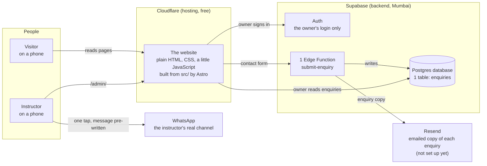
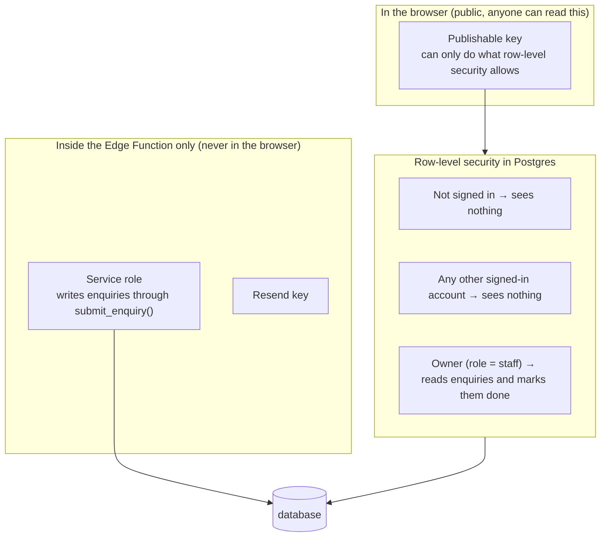
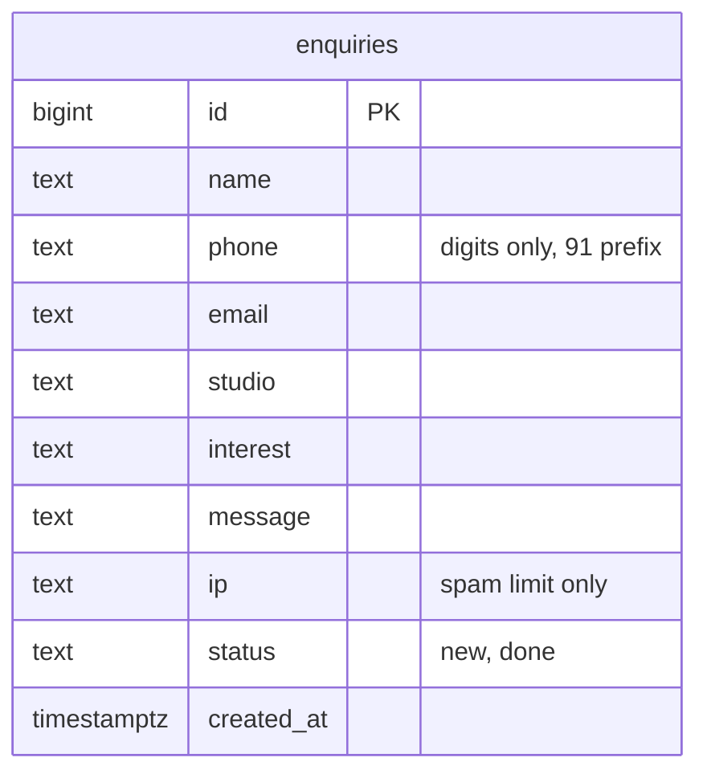
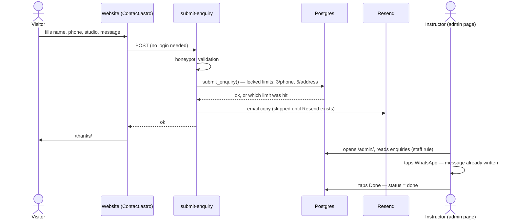
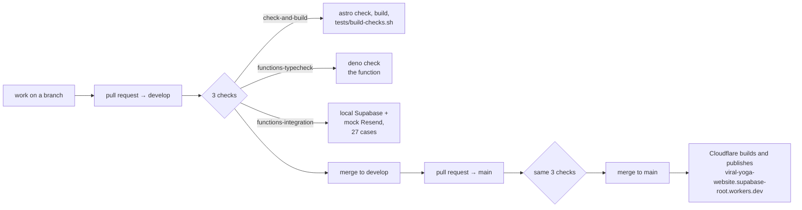

# How the Viral Yoga & Nature Cure website fits together

Last updated: 11 September 2026. Every name in this document is a real file, table or service in this repository. If something here disagrees with the code, the code is right and this page needs fixing.

The diagrams render on GitHub. Read this page at https://github.com/datewithcode/viral-yoga-website/blob/main/docs/ARCHITECTURE.md.

## 1. The whole system on one page

There are four moving parts and two outside companies. Nothing else.

**The key idea:** the website is a folder of finished files. It has no server of its own. Everything that needs a server, a database or a secret runs inside Supabase. That is why hosting is free and why the public pages keep working even if Supabase is asleep.

## 2. Where everything lives

| Piece | Where | What it is |
|---|---|---|
| All content | `src/data/site.ts` | Every name, number, address, fee, sentence, class and question |
| Pages | `src/pages/*.astro` | `index` (home), `admin`, `privacy`, `terms`, `thanks`, `404` |
| Sections of the home page | `src/components/*.astro` | One file per section, in the order they appear on the page |
| Browser helper | `src/lib/supabase.ts` | Creates the Supabase client used by the contact form and the admin page |
| Styling | `src/styles/global.css` | Colours and fonts as Tailwind tokens, plus the shared button and field classes |
| Database | `supabase/migrations/*.sql` | The tables, their rules, and every change in order. Only `enquiries` is left |
| Server code | `supabase/functions/submit-enquiry/index.ts` | The contact-form function, plus `_shared/phone.ts` |
| Hosting config | `wrangler.toml`, `public/_headers`, `.node-version` | Cloudflare reads these. `netlify.toml` is left over and unused |
| Tests | `tests/` | 27 backend cases, 7 build checks, and a browser script for phone widths |
| Automatic checks | `.github/workflows/ci.yml` | Three jobs on every change, described in section 7 |

## 3. Who can see what

This rule is enforced by the database, not by the website.

- The **publishable key** is in the code on purpose. It cannot read anything the rules do not allow.
- The **owner** is one Supabase user whose `app_metadata.role` is `staff`. Only SQL can set that; no form can. The admin page signs any other account straight out.
- **Nobody else needs an account.** With "Allow new users to sign up" switched off in Supabase Auth, none can be created.
- **Enquiries arrive through the function**, which checks the honeypot, validates the fields and applies the rate limits inside `submit_enquiry()`. A visitor cannot write one any other way, or call `submit_enquiry()` directly.
- **Secrets** live only as Supabase function secrets. The website never sees them.

## 4. The database

One table. `ip` exists only for rate limiting. Nothing else about visitors is stored.

## 5. Flow: someone asks about a trial class

This is the loop the instructor uses every day, and it is fully confirmed on the live site.

If the function is unreachable the form tells the visitor to WhatsApp instead. There is no second place the message can go.

## 6. Flow: the owner signs in

The admin page signs in with email and password. If the account's `app_metadata.role` is not `staff`, the page signs it out again and says so. Once in, it lists the 50 newest open enquiries; Done sets an enquiry's status to `done`. The website has no other sign-in.

## 7. How code reaches the live site

- Nothing is committed to `main` directly. It is protected, and all three checks are required before a merge, not just the first.
- Database changes are SQL files in `supabase/migrations/`. They were applied to the live project with the Supabase tools; the function was deployed the same way. There is no automatic backend deploy.

## 8. What is deliberately not there

- **No server of our own.** Cloudflare serves files; Supabase runs the logic. Nothing to patch, nothing to keep awake except Supabase itself.
- **No payments.** Fees are paid at the studio; the fee list on the site is for information.
- **No member records and no member logins.** The website does not know who is a member. Removed on 11 September; the earlier version is on branch `main_backup_payment` and tag `backup-2026-09-11`.
- **No automatic WhatsApp messages.** Replies are tap-to-send, by design.
